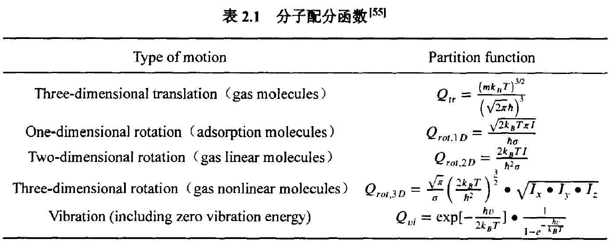

# Microkinetics of Steam Reforming of Methanol
## Step 1. Transition state search by CL-NEB and Dimer methods
For a given elementary reaction, we identify the transition state with CL-NEB and Dimer methods and then compute the activation energy ($E_{\rm a}$) with the transition state theory.
Typical INCAR files of [VASP](https://www.vasp.at/wiki/index.php/The_VASP_Manual) for CL-NEB and Dimer methods are [INCAR_neb](./INCAR_neb) and [INCAR_dimer](./INCAR_dimer), respectively. 

## Step 2. Pre-exponent factor calculations ($A' \cdot T^b$)

According to the [transition state theory](http://websites.umich.edu/~elements/03chap/html/transition/index.htm), the reaction rate constant of elementary reaction is
 $k=\frac{k_BT}{h} \frac{Q'}{Q_R} \cdot {\rm exp}(-\frac{E_{\rm a}}{{\rm R}T})=A'\cdot T^b\cdot {\rm exp}(-\frac{E_{\rm a}}{{\rm R}T})$  

Here, $k_{\rm B}$ is the Boltzmann constant, $T$ the temperature, $h$ Planck's constant, $Q'$ the partition function of the transition state excluding the motion along the reaction coordinate, $Q_{R}$ the partition function of the reactant, $E_{\rm a}$ the activation energy, and ${\rm R}$ the ideal gas constant. Partition functions for different types of motions are obtained from the following table: 
 
 

For the vibrational partition function, a typical INCAR (input file of [VASP](https://www.vasp.at/wiki/index.php/The_VASP_Manual)) for vibrational frequency calculations is [INCAR_freq](./pre-exponent_factors/INCAR_freq), and the main output file is [freq.dat](./k_24.dat). The codes [prefactor_g++](./pre-exponent_factors/prefactor_g++) and [nonactive_prefactor_g++](./pre-exponent_factors/nonactive_prefactor_g++) can be used to calculate the pre-exponent factor directly from a [freq.dat](./k_24.dat) file. For example, we can obtain the temperature-dependent pre-exponent factors of ${\rm C^*+O^*\rightarrow CO^* + ^*}$ using [T_prefactor.sh](./T_prefactor.sh), reactants/[freq.dat](./freq_ini), and transition/[freq.dat](./freq_trans).
=======
## Step 2. Pre-exponent factor calculations

According to the [transition state theory](http://websites.umich.edu/~elements/03chap/html/transition/index.htm), the reaction rate constant of an elementary reaction is
 $k=\frac{k_BT}{h} \frac{Q'}{Q_R} \cdot {\rm exp}(-\frac{E_{\rm a}}{{\rm R}T})=A'\cdot T^b\cdot {\rm exp}(-\frac{E_{\rm a}}{{\rm R}T})$  

Here, $k_{\rm B}$ is the Boltzmann constant, $T$ the temperature, $h$ Planck's constant, $Q'$ the partition function of the transition state excluding the motion along the reaction coordinate, $Q_{\rm R}$ the partition function of the reactant, $E_{\rm a}$ the activation energy, and ${\rm R}$ the ideal gas constant. Partition functions of different types of motions are obtained using formula list in the following table: 
 
 

The rate constant $k$ computed from DFT and transition state theory is fitted to the form of $k=A'T^b\exp(-\frac{\Delta E_{a}}{{\rm R}T})$ where $A'$ is a temperature-independent parameter and $T^b$ describes the temperature dependence of the frequency factor.

A typical INCAR for vibrational frequency calculations is [INCAR_freq](./pre-exponent_factors/INCAR_freq), and the main output file is [freq.dat](./k_24.dat). The codes [prefactor_g++](./pre-exponent_factors/prefactor_g++) and [nonactive_prefactor_g++](./pre-exponent_factors/nonactive_prefactor_g++) can be used to calculate the pre-exponent factor directly with the [freq.dat](./k_24.dat) file. For example, we can obtained the pre-exponent factors of ${\rm C^\*+O^\* \rightarrow CO^\* + ^\*}$   vs. temperature using [T_prefactor.sh](./T_prefactor.sh) and [freq.dat](./freq_ini) of reactants and [freq.dat](./freq_trans) of the transition state as follows:
>>>>>>> a2c13638f60c34c4f14b295f490ccc9c1351801a

| Temperature (K) | $A'\cdot T^b$ |
|-------------|-------------|
|673 | 3.31043e+13|
|723 | 3.32805e+13|
|773 | 3.34333e+13|
|823 | 3.35661e+13|
|873 | 3.36820e+13|
|923 | 3.37836e+13|
|973 | 3.38731e+13|
|
||
|The temperature dependence of the pre-exponent factors is fitted as $A'\cdot T^b$.||

<<<<<<< HEAD
## Step 3. Microkinetic modeling

We use the rate constants of elementary reactions as inputs to construct an input file of CHEMKIN, [surf_e0](./input_of_chemkin/surf_e0). The reaction conditions are the same as the experimental conditions reported in [Liu _et al._](https://www.sciencedirect.com/science/article/pii/S0920586117305631?via%3Dihub): the feed rate is 10 min/cc and the catalyst surface area is about 0.14 m$^2$. A sample file including all other settings is supplied in [steam_methanol_reforming.ckprj](./input_of_chemkin/steam_methanol_reforming.ckprj). The results from the microkinetic modeling are in good agreement with experiments as shown in the following figure:
 .

The CHEMKIN input files for the microkinetic modeling of SRM under specified electric fields are also supplied, and they are generated using the script [cheminp_out.sh](./cheminp_out.sh).
=======
## Step3. Microkinetics

We then use the rate constants of elementary reactions as inputs to construct a [input file of CHEMKIN](./input_of_chemkin/surf_e0). The reaction conditions are taken from the experimental work of [Liu _et al._](https://www.sciencedirect.com/science/article/pii/S0920586117305631?via%3Dihub): feed rate is 10 min/cc and the catalyst surface is about 0.14 ${\rm m^2}$. A sample model file including all conditions is supplied in [the CHEMKIN model file](./input_of_chemkin/steam_methanol_reforming.ckprj). The results from the microkinetic modeling agree well with experiments:
 .

A CHEMKIN input file for modeling SRM under various electric fields is also provided as [input_file_CHEMKIN](./input_of_chemkin), and they are generated using the [cheminp_out.sh](./cheminp_out.sh) script.
>>>>>>> a2c13638f60c34c4f14b295f490ccc9c1351801a
