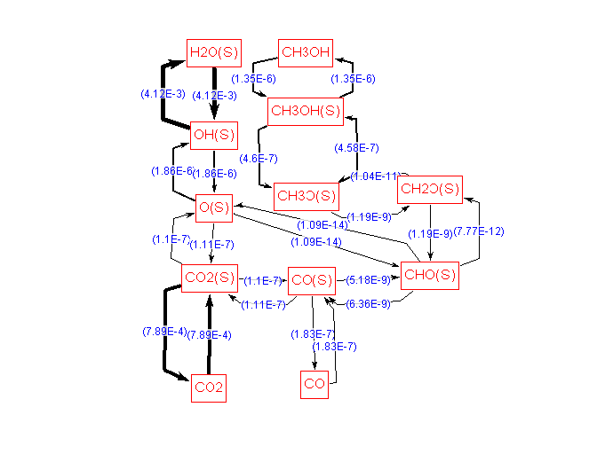
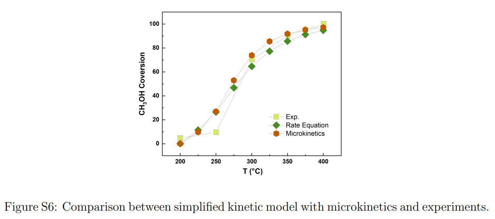

## Step 1 Rate-determining step and simplified kinetic model

The typical reaction path of steam reforming of methanol at experimental conditions is,

Based on the microkinetic model, we perform sensitivity analysis by computing the partial derivatives of methanol conversion rate with respect to the rate constant of individual elementary reation, as follows (greater than 0.01),

Two rate determining steps are found in steam reforming of methanol, then we constructed a simplified kinetic model, in which just two rate determing steps are considered as non-equlibrium reactions, and the python code of this model is supplied in the [simplified kinetic model file](./MSR_CSTR.py), which is well consisted with the results of microkinetic models.

## Step 2 Kinetics with linear scaling relationship
The scaling relationship is introduced to the simplified kinetics, including $\Delta E_{a,\rm CH_3OH} = 0.17E_{\rm ad, C*} + 0.36E_{\rm ad, O*} -23.004$ (eV), $\Delta E_{a,+}^{\rm WGS} = 0.25E_{\rm ad, C*} + 0.825E_{\rm ad, O*}+6.114$ (eV), $\Delta E_{a,-}^{\rm WGS} = 0.25E_{\rm ad, C*} + 0.825E_{\rm ad, O*}+6.985$ (eV).
we substitued the activation and adsorption energies in the simplified kinetics by the linear scaling relationship. it can be used to generate a volcano plot, as supplied in [volcano_plot.py](./volcano_plot.py).

