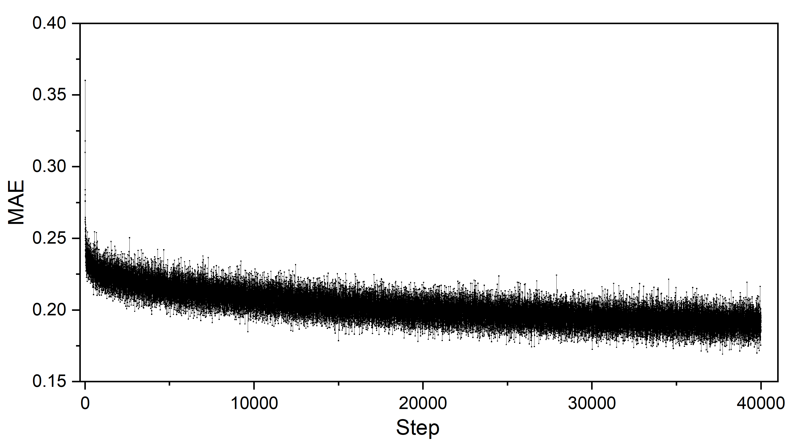
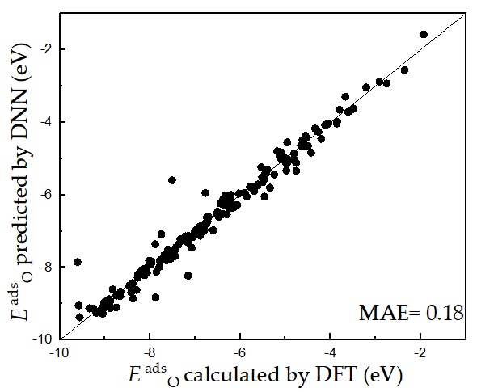
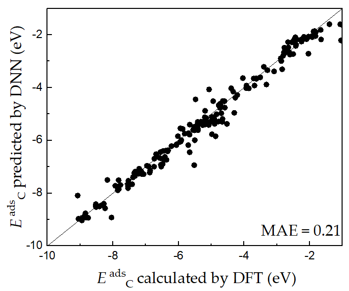

# Adsorption Energies Prediction by Deep Learning
## Step 1: Use DFT to prepare database  
The databases of C and O adsorption energy on CsCl-structure binary alloys are provided in [database_C](./database_C.dat)  and [database_O](./database_O.dat), respectively.  
  
## step 2. DNNs training
[kerasNN.py](./kerasNN.py) is a script for DNN training, whose input data includes the databases of [database_C](./database_C.dat)  and [database_O](./database_O.dat). Parameters of DNNs in this work includes: the number of neurons of the input layer is 21, including 10 features for each of the two elements and the coordination number of the adsorption site; the 10 features of each element are the numbers of s-, p-, d-, and f-electrons, the first and second ionization potentials, the electron affinity, the covalent radius, the main valence state, and the row number of the element in the periodic table; there are eight hidden layers with a width of 20; the activation function of the input and hidden layers is the exponential linear unit (ELU); the output layer is a linear neuron that exports the adsorption energy of C* or O*; the mean absolute error (MAE) was used as the loss function; the optimization algorithm of AdaMax was adopted; the learning rate is 0.004. The ratio of the training and validation data is 3:1. After training, you will get the trained DNN model file for [C](./model_file_C.h5) and [O](./model_file_O.h5), respectively.
### Training error is:
 
### Validation results:

  

## Step 3. Use trained model to predict O and C adsorption energy of alloys
run: python [NNPredict.py](./NNPredict.py) (input files include [properties of alloys](./properties_of_alloys.dat) and [trained DNN model file](model_file_C.h5)). 

