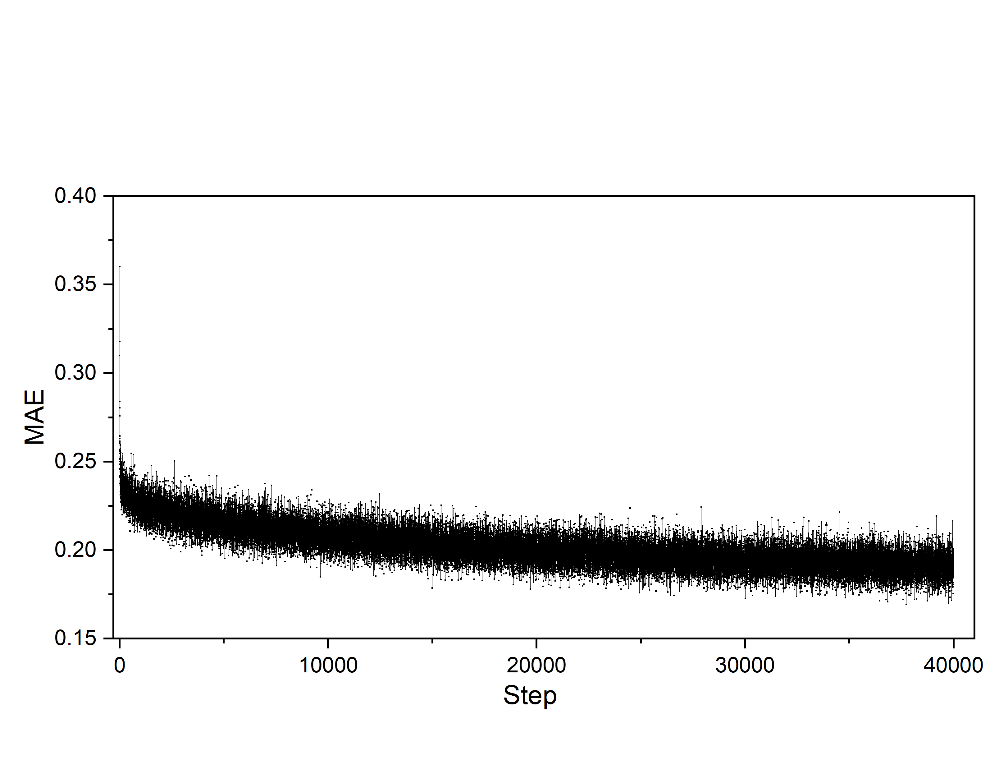
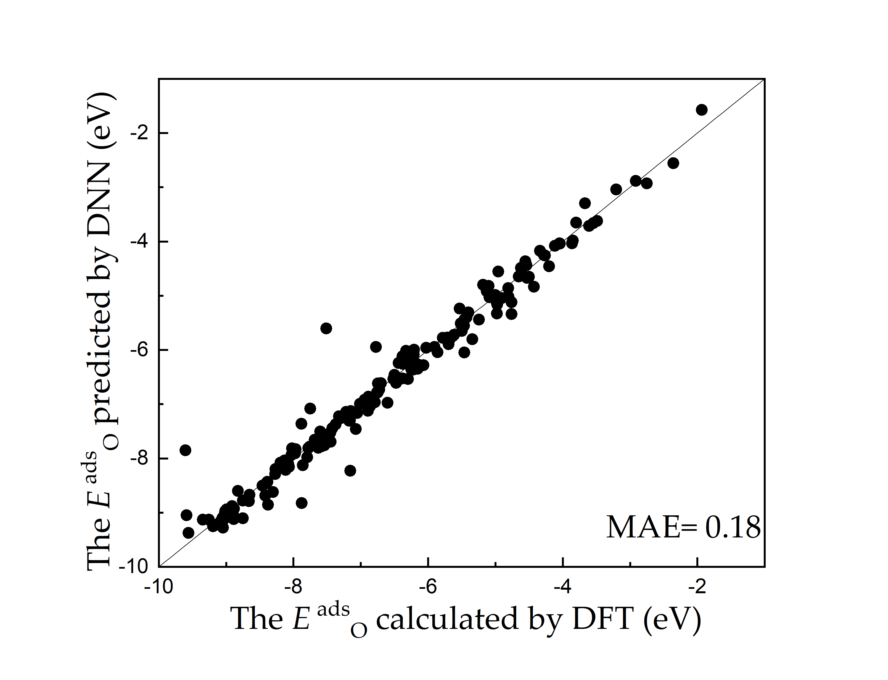
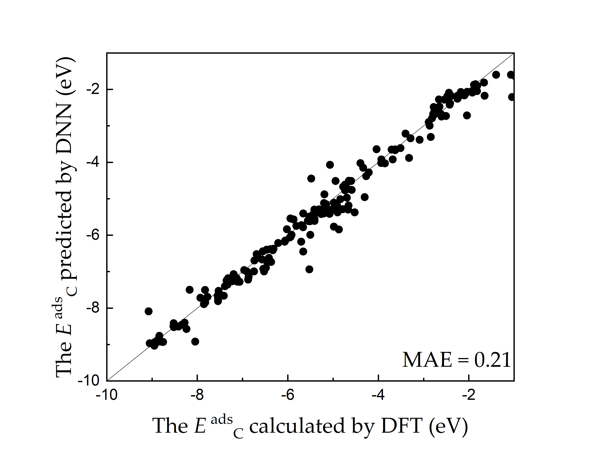

## Step 1: Using DFT to prepare database  
The database is provided in [C](./database_C.dat)  
and [O](./database_O.dat) for C and O adsorption, especially.  
  
## step 2. Use database_DNN.dat to train DNNs
run: python [kerasNN.py](https://github.com/kechangming/DL-accelerated-catalysis-design/blob/main/kerasNN.py)   
output: trained_model_file for [C](https://github.com/kechangming/DL-accelerated-catalysis-design/blob/main/model_file_C.h5) and [O](https://github.com/kechangming/DL-accelerated-catalysis-design/blob/main/model_file_O.h5) 
### Training error:
 
### Training results:

  

## Step 3. using trained model to predict O and C adsorption energy of alloys
run: python NNPredict.py (inputs include properties_of_alloys.txt and model_file.h5)

