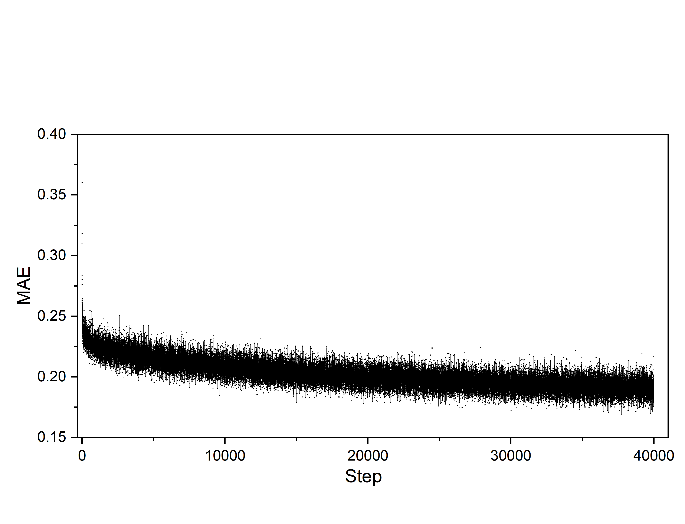
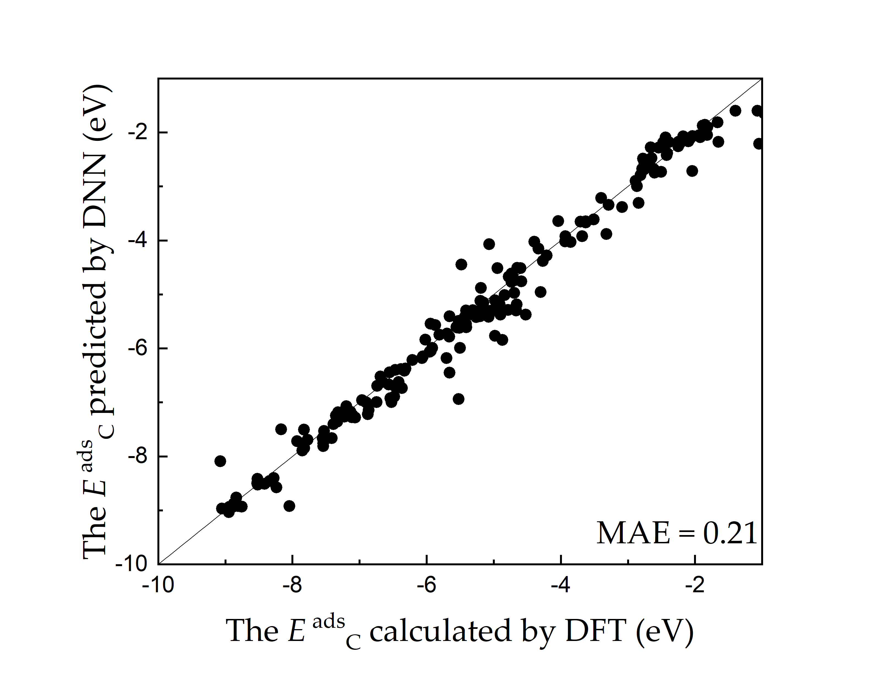

# Adsorption Energies Prediction by Deep Learning
## Step 1: Use DFT to prepare database  
The database is provided in [database_C](./database_C.dat)  
and [database_O](./database_O.dat) for C and O adsorption, respectively.  
  
## step 2. DNNs training
run: python [kerasNN.py](./kerasNN.py)   
you will get the trained DNN model file for [C](./model_file_C.h5) and [O](./model_file_O.h5), respectively.
### Training error:
 
### Validation results:

  

## Step 3. using trained model to predict O and C adsorption energy of alloys
run: python [NNPredict.py](./NNPredict.py) (inputs include [properties of alloys](./properties_of_alloys.dat) and [trained DNN model file](model_file_C.h5)). 

