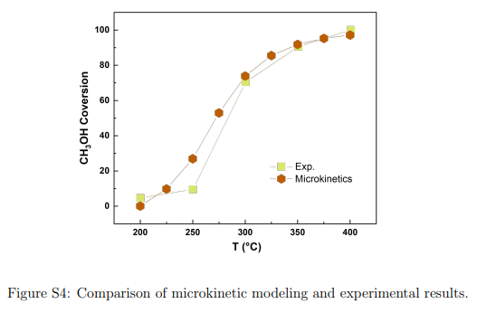
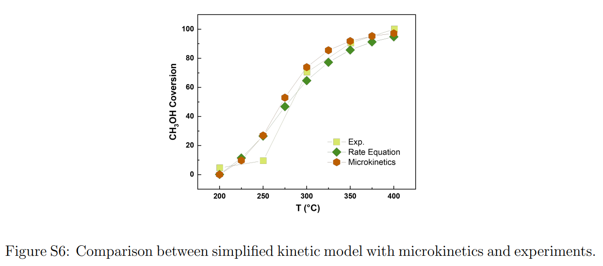

# Establishment of microkinetics of Steam methanol reforming
## Step1. Transition state search by CL-NEB and Dimer method ($E_{\rm a}$)

## Step2. Pre-exponent factor calculations ($A'$)

Acoording to the [transition state theory](http://websites.umich.edu/~elements/03chap/html/transition/index.htm), the reaction rate constant of elementary reaction is
 $k=\frac{k_BT}{h} \frac{Q'}{Q_R} \cdot {\rm exp}(-\frac{E_{\rm a}}{{\rm R}T})=A'\cdot T^b\cdot {\rm exp}(-\frac{E_{\rm a}}{{\rm R}T})$  

Here, $k_{\rm B}$ is the Boltzmann constant, $T$ the temperature, $h$ Planck's constant, $Q'$ the partition function of the transition state excluding the motion along the reaction coordinate, $Q_{\rm R}$ the partition function of the reactant, $E_{\rm a}$ the activation energy, and ${\rm R}$ the ideal gas constant. Partition function of modes is obtained from below table: 
 
 

For the vibrational partition function, a typical INCAR (input file of [VASP](https://www.vasp.at/wiki/index.php/The_VASP_Manual) for vibrational frequency calculations is [INCAR_freq](./pre-exponent_factors/INCAR_freq), and the main output file is [freq.dat](./k_24.dat). The code in [prefactor_g++](./pre-exponent_factors/prefactor_g++) and [nonactive_prefactor_g++](./pre-exponent_factors/nonactive_prefactor_g++) can be used to calculate pre-exponent factor directly from a freq.dat file. For example, we can obtained the pre-exponent factors of ${\rm C^*+O^*\rightarrow CO^* + ^*}$ vs. temperature as table below according to its freq.dat of [transition state]() and [reactants]():

| Temperature | $A'\cdot T^b$ |
|-------------|-------------|
|element1 | element2|
|element3 | element4|

Then its temperature dependence is fitted as $A'\cdot T^b$.

## Step3. Microkinetic calculations 

The elementary reaction network is constructed based on rate constant $A'T^b\cdot {\rm exp}(-\frac{E_a} {RT})$. And the continuous-stirred tank reactor model based on elementary reaction network of steam reforming of methanol at experimental conditions of [Liu _et al._](https://www.sciencedirect.com/science/article/pii/S0920586117305631?via%3Dihub) is supplied in [the CHEMKIN model file](./input_of_chemkin/steam_methanol_reforming.ckprj), which is in good agreement with experiments:
 .

The input file of steam reforming of methanol under electric field {-0.5..0.5 V/angstrom} is supplied in [input_file_CHEMKIN](./input_of_chemkin)

## Step4. Rate-determining step and simplified kinetic model

The typical reaction path of steam reforming of methanol at experimental conditions is,

Based on the microkinetic model, we perform sensitivity analysis by computing the partial derivatives of methanol conversion rate with respect to the rate constant of individual elementary reation, as follows (greater than 0.01),

Two rate determining steps are found in steam reforming of methanol, then we constructed a simplified kinetic model, in which just two rate determing steps are considered as non-equlibrium reactions, and the python code of this model is supplied in the [simplified kinetic model file](./MSR_CSTR.py), which is well consisted with the results of microkinetic models.

