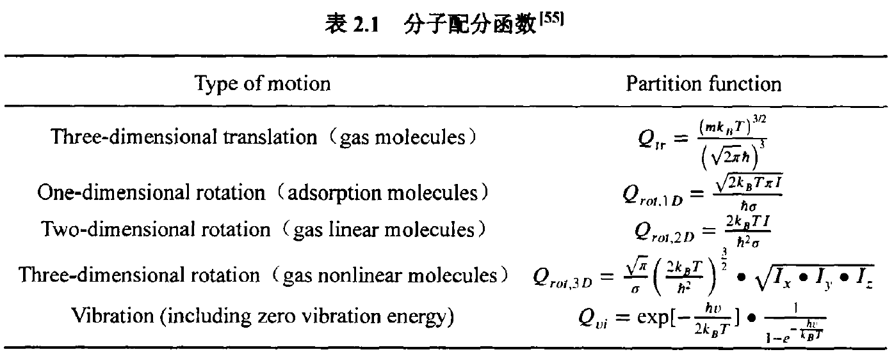

# Establishment of microkinetics of Steam methanol reforming
## Step1. Transition state search by CL-NEB and Dimer method ($E_{\rm a}$)

## Step2. Pre-exponent factor calculations ($A'$)

Acoording to the [transition state theory](./), the reaction rate constant of elementary reaction is
 $k=\frac{k_BT}{h} \frac{Q'}{Q_R} \cdot {\rm exp}(-\frac{E_{\rm a}}{{\rm R}T})=A'\cdot T^b\cdot {\rm exp}(-\frac{E_{\rm a}}{{\rm R}T})$  

Here, $k_{\rm B}$ is the Boltzmann constant, $T$ the temperature, $h$ Planck's constant, $Q'$ the partition function of the transition state excluding the motion along the reaction coordinate, $Q_{\rm R}$ the partition function of the reactant, $E_{\rm a}$ the activation energy, and ${\rm R}$ the ideal gas constant. Partition function of modes is obtained from below table: 
 
 

For the vibrational partition function, a typical INCAR (input file of [VASP](./)) for vibrational frequency calculations is [INCAR_freq](./pre-exponent_factors/INCAR_freq), and the main output file is [freq.dat](). The code in prefactor_g++ and nonactive_prefactor_g++  can be used to calculate pre-exponent factor directly from a [freq.dat]() file. For example, we can obtained the pre-exponent factors of ${\rm C^*+O^*\rightarrow CO^*}$ vs. temperature as table below according to its freq.dat of [transition state]() and [reactants]():

| table title | table title |
|-------------|-------------|
|element1 | element2|
|element3 | element4|

so its temperature dependence can be fitted as $A'\cdot T^b$.

## Step3. Microkinetic calculations 

The elementary reaction network is constructed based on rate constant $A'T^b\cdot {\rm exp}(-\frac{E_a} {RT})$. The CSTR model file based on experiments of [author]() is supplied as [model file](./input_of_chemkin/steam_methanol_reforming). And the results is shown as .

the case for methanol steam reforming considered electric field {-0.5..0.5} in [input_file](./input_of_chemkin)

## Step4. Main reaction pathway and rate-determining step

according to the main reaction path to derive the simply reaction equation.
The simplified model is,

and the python code for solving this equation is supplied xx.

as shown by follow figure, the simplified is consisted with the results of microkinetic models.

