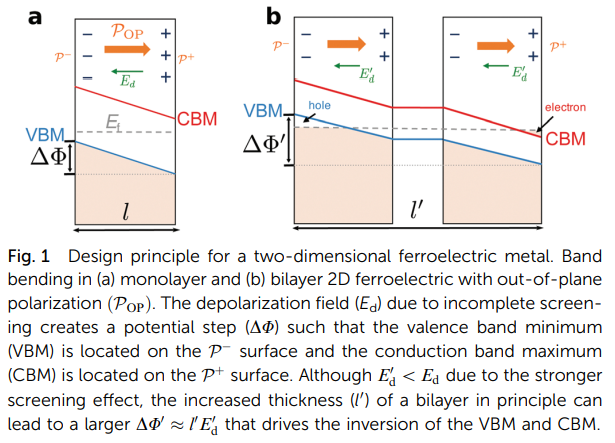
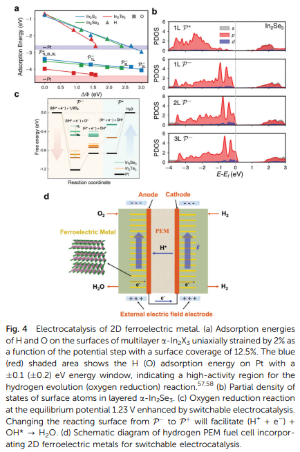
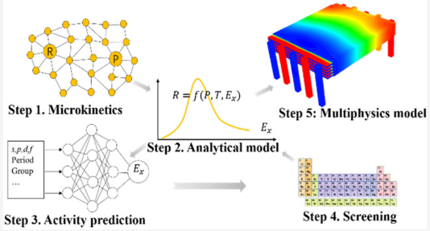
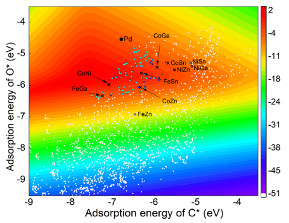
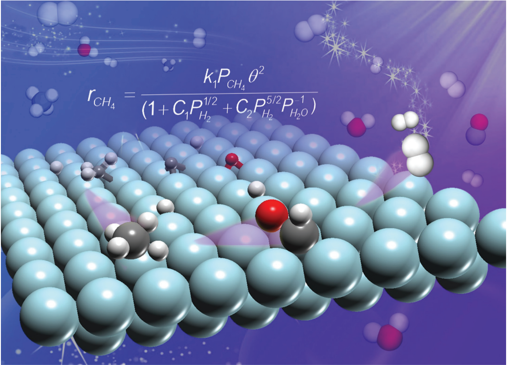
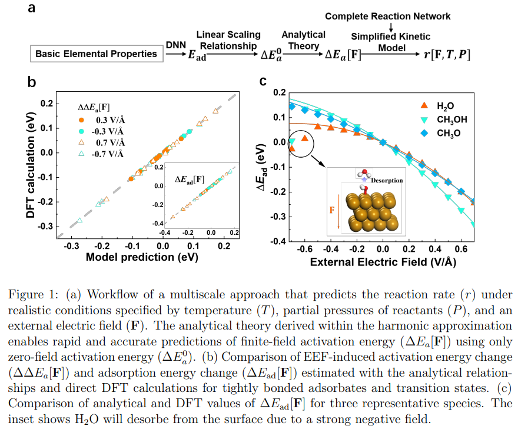
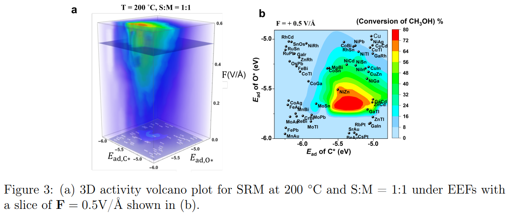
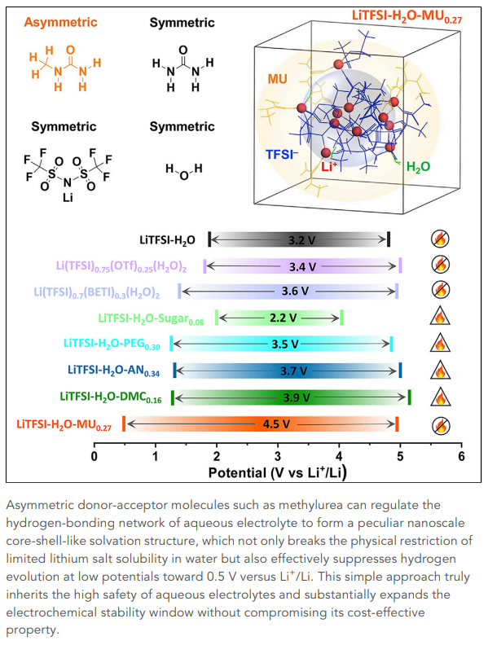
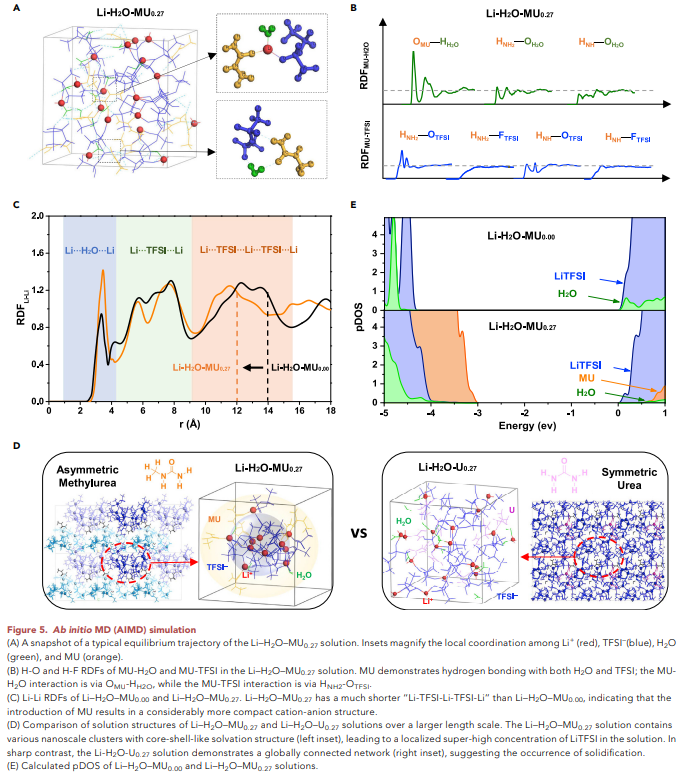

# Research Introduction of Changming Ke

## Ferroelectric catalysis

1. [**Changming Ke**; Jiawei Huang; Shi Liu*; Two-dimensional ferroelectric metal for electrocatalysis, Mater. Horiz., 2021, 8, 3387-3393](https://pubs.rsc.org/en/content/articlehtml/2021/mh/d1mh01556g)   
We clarify the concept of the ferro-electric metal by revisiting the original definitions for ferroelectric and metal. Two-dimensional (2D) ferroelectrics with out-of-plane polarization can be engineered via layer stacking to a genuine ferroelectric metalcharacterized by switchable polarization and non-zero density of states at the Fermi level. 

We also demonstrate that 2D ferroelectric metals can serve as electrically-tunable, high-quality electrocatalysts:

## Heterogeneous catalysis design

2. [**Changming Ke**; Weigang He; Shixue Liu; Xiao Ru; Shi Liu; Zijing Lin*; Multiscale catalyst design for steam methane reforming assisted by deep learning, J. Phys. Chem. C, 2021, 125, 10860-1086](https://liutheory.westlake.edu.cn/pdf/Ke21p10860.pdf)
Computational design of high-quality catalysts targeting specific operation conditions is a challenging task due to the mechanistic, structural, and environmental complexities across multiple length and time scales. We proposed a multiscale method of a catalyst design linking ab initio calculations, microkinetics, and multiphysics modeling to address this challenge.

We applied the multiscale method to the design of carbon-resistant steam methane reforming catalysts, successfully identifying a few cost-efficient bimetallic alloys for CH4 internal reforming solid oxide fuel cells. The multiphysics modeling  demonstrates that catalysts of relatively low activity such as NiZn are actually beneficial for fuel efficiency, highlighting the importance of the multiphysics model for a multiscale computational catalyst design.

3. [**Changming Ke**; Zijing Lin*; Elementary reaction pathway study and a deduced macrokinetic model for the unified understanding of Ni-catalyzed steam methane reforming, React. Chem. & Eng. 2020, 5, 873-885](https://pubs.rsc.org/en/content/articlelanding/2020/re/c9re00460b#!divAbstract)
We constructed a complex microkinetic model and derived an analytical expression of the steam methane reforming rate. And they yields a coherent explanation of the seemingly incompatible experimental data on the reaction orders of CH$_4$, H$_2$O and H$_2$ and the activation energy of steam methane reforming. 

4. [**Changming Ke**; Zijing Lin; Shi Liu*; Three Dimensional Activ-ity Volcano Plot under External Electric Field](https://doi.org/10.48550/arXiv.2202.11281)
We derive an analytical theory that relates the finite-field avtivation energy to electric field strength and developed a multiscale approach that progressively bridges finite-field density functional theory, microkinetic modeling and deep learning-assisted high-throughput computations, 

which leads to the construction of a three-dimensional activity volcano plot under electric field for thousands of metallic alloys.

5. [**Changming Ke**; Zijing Lin*; Density Functional Theory Based Micro- and Macro-Kinetic Studies of Ni-Catalyzed Methanol Steam Reforming, Catalysts, 2020, 10: 349-360](https://www.mdpi.com/2073-4344/10/3/349)
We constructed the microkinetics of methanol steam reforming on Ni surface.

6. [**Changming Ke**; Zijing Lin*; Catalytic Effect of Hydrogen Bond on Oxhydryl Dehydrogenation in Methanol Steam Reforming on Ni(111), Molecules, 2020, 25: 1531-1540](https://www.mdpi.com/1420-3049/25/7/1531)
We found the catalytic effect of hydrogen bond in methanol steam reforming.

## Li-battery electrolyte structures

7. [Rui Lin, **Changming Ke**, Juner Chen, Shi Liu* and Jianhui Wang*, symmetric donor-acceptor molecule-regulated core-shell-solvation electrolyte for high-voltage aqueous batteries, Joule, 2022, 2, 399-41 **(co-first author)**](https://www.sciencedirect.com/sdfe/reader/pii/S2542435122000022/pdf)
We report a new all-nonflammable-ingredient aqueous electrolyte via hybridizing with nonflammable methylurea. The structurally asymmetric methylurea molecules possessing both donor and acceptor functional groups regulate the hydrogen bonding network, resulting in peculiar nano-scale core-shell-like clusters. Such unique solution structure allows localized super-high salt concentration in the electrolyte and suppresses HER at 0.5 V versus Li+/Li, achieving a 4.5 V electrochemical window. 

**My contribution to this project is:**  Theoretically found the core-shell-like strucutre in methylurea-hybridation water in salt electrolyte based on _ab initio_ molecular dynamics.
 

8. Juner Chen; Han Wang; **Changming Ke**; Shi Liu*; Jianghui Wang*; Design localized salt-concentrated electrolytes via donor number and solubility **(Under review, co-first author)**     
**My contribution to this project is:** Revealed a linear scaling relationship between DN and the Li-solvent interaction strength, elucidating the correlation between DN and electrolyte structures by the first-principles calculations.
